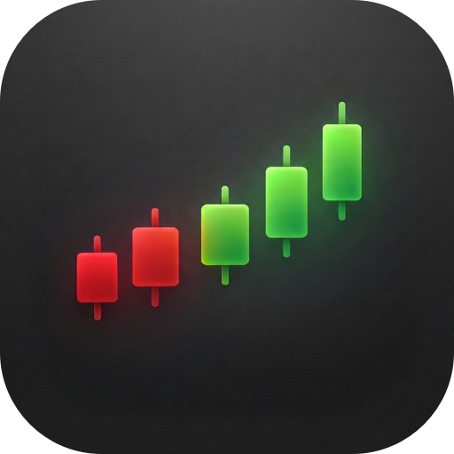
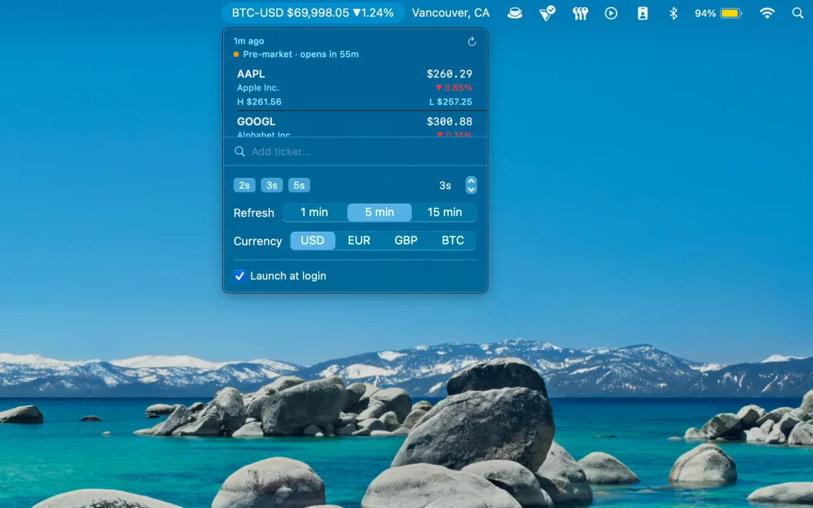
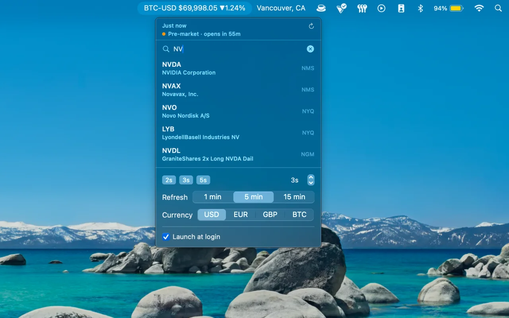

<div align="center">
  
  <h1>Crest</h1>
</div>

<p align="center">
  <a href="https://github.com/zekevh/crest/releases/latest"></a>
  
  
  
</p>

Watch your market, from your menu bar.

<p align="center">
  
  
</p>

## Install

```sh
brew install --cask zekevh/crest/crest
```

Or [download the DMG](https://github.com/zekevh/crest/releases/latest).

## Features

- Stocks, ETFs, and crypto in a single watchlist
- Live ticker in the menu bar — carousel or scrolling tape
- Color-coded at a glance — green up, red down
- Add any symbol: AAPL, VOO, BTC-USD, ^GSPC
- Day price, change %, high and low in one panel
- Native Swift — no Electron, no background processes
- Universal binary: Apple Silicon + Intel

> Prices via Yahoo Finance, delayed up to 15 min.

## You may also like

- [Whereabouts](https://github.com/zekevh/whereabouts) — know where your connection is
- [Moka](https://github.com/zekevh/moka) — caffeinate with control

## License

MIT © [Zeke V. Holt](https://zvh.io)
